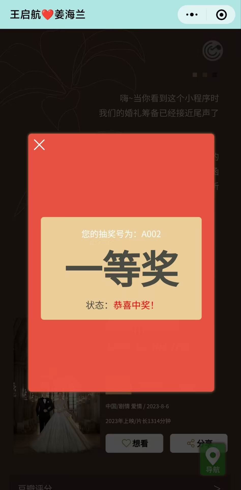
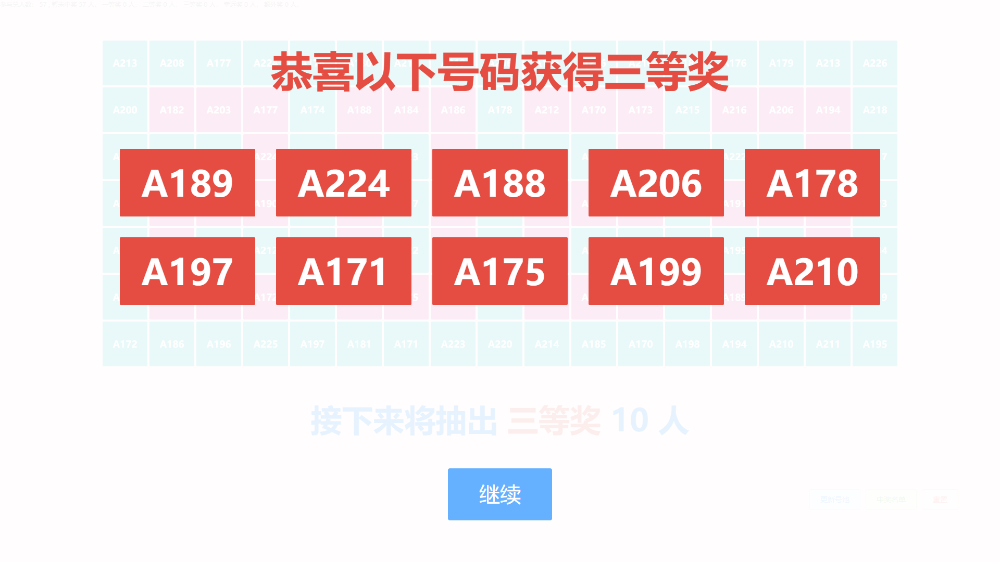
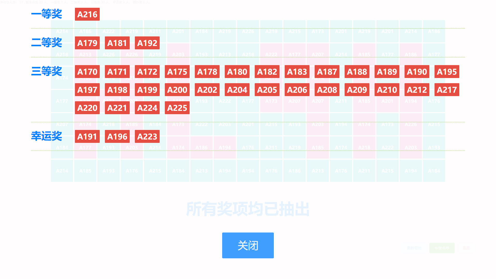

### 这是一个婚礼用的请柬+大屏抽奖系统，由以下部分组成：

* 一个微信小程序实现婚礼邀请函与扫码获取抽奖码功能（UniApp + uViewUI）

* 一个WEB大屏实现抽奖功能（Vue2.0 + ElementUI）

* 一个后端负责逻辑处理（Python + MySQL）

### 扫码预览（邀请函）：


### 抽奖相关截图：

#### 小程序

<div style="display:flex;align-item:center;flex-wrap:wrap;">
</img>
</img>
</img>
</img>
</div>

#### 大屏

<div style="display:flex;align-item:center;flex-wrap:wrap;">
</img>
</img>
</img>
</img>
</div>

## 微信端（front）

```shell
npm install
npm run serve
```

更多详见[uniapp文档](https://zh.uniapp.dcloud.io/worktile/CLI.html)


## PC端（pc）

```shell
npm install
npm run serve
```

更多详见[通用前端框架文档](https://github.com/dr34-m/front-demo)

## 后端

### 导入Sql

导入`server/sql/wedding.sql`文件

### 修改配置

项目根目录新建`conf.json`文件，并修改如下

```shell
vim conf.json
```

 **去掉注释，否则报错**

```js
{
    "server": {
        "port": 9014, // 启动端口
        "thread": 10 // 启动线程数
    },
    "mysql": { // mysql相关信息
        "host": "127.0.0.1",
        "port": 3306,
        "db": "wedding",
        "user": "root",
        "passwd": "root"
    },
    "wechat": {
        "appId": "xxxxx",
        "AppSecret": "xxxxx"
    }
}
```

### 安装依赖

```shell
python3 -m pip install --upgrade pip -i https://pypi.doubanio.com/simple/
pip3 install -r requirements.txt -i https://pypi.doubanio.com/simple/
```

### 运行

```shell
python3 main.py
```

### 注册成系统服务（可选）

```shell
vim /etc/systemd/system/wedding.service
```

注意把下边的设置应用的工作目录与Python3目录修改为自己真实的

```shell
[Unit]
Description=weddingServer

[Service]
Type=simple
User=root
Group=root

WorkingDirectory=/opt/python
ExecStart=/usr/bin/python3 /opt/python/main.py
Restart=always
ExecStop=/bin/kill -s TERM $MAINPID

[Install]
WantedBy=multi-user.target
```

#### 重载系统服务

```shell
systemctl daemon-reload
```

#### 启动/停止/查看

```shell
systemctl start wedding
systemctl stop wedding
systemctl status wedding
```

#### 开机自启

```shell
systemctl enable wedding
```

## 如对您产生了帮助请赞赏我，一分钱也是爱

</img>

## 如需定制开发可以联系我

</img>

## 附上完整邀请函截图


</img>